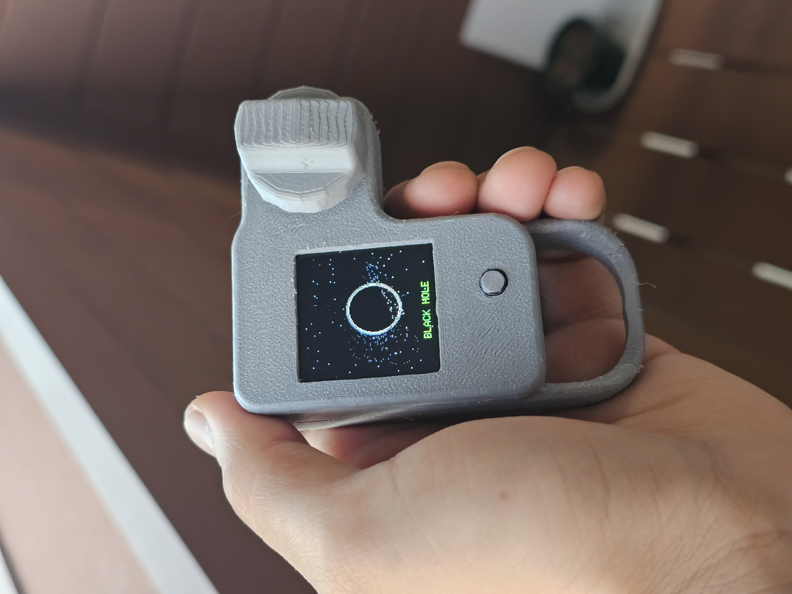
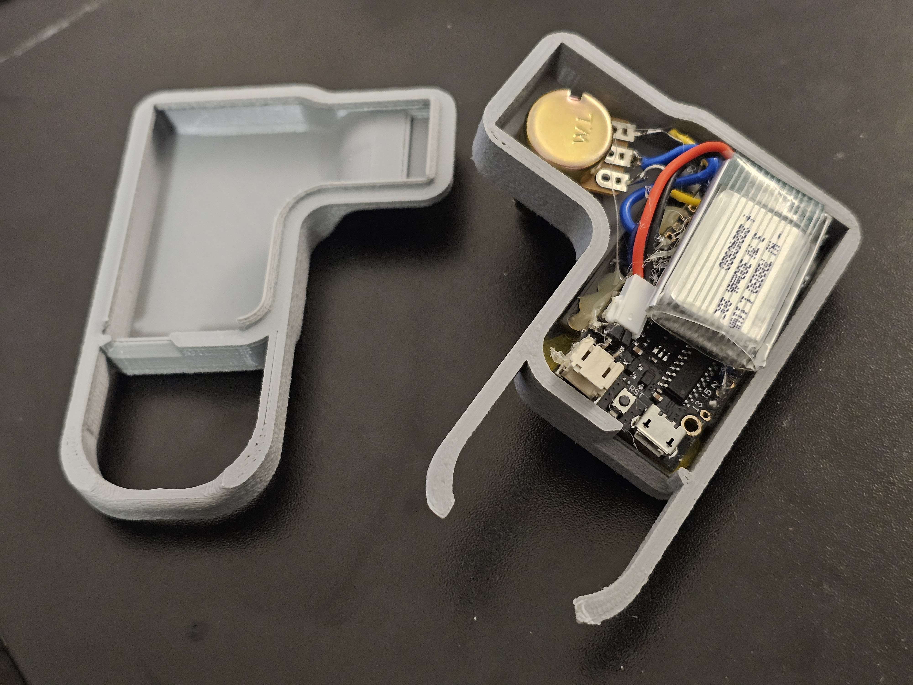
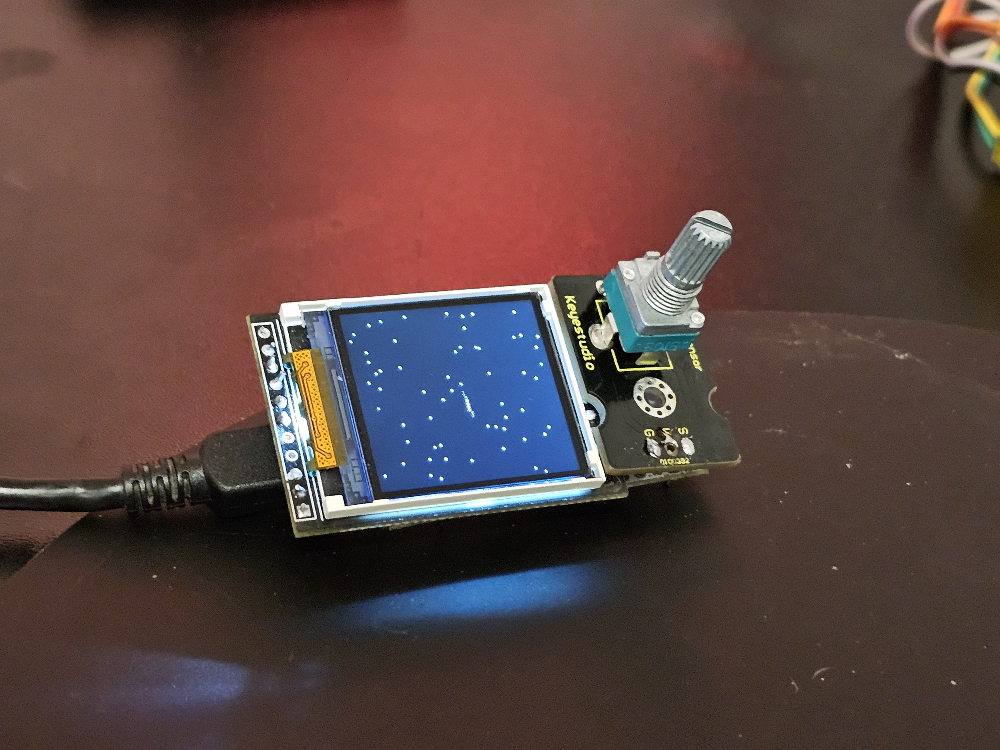

# Cosmic Knobulator - Universe Explorer Toy 🚀🪐

**Blast off into a hands-on, educational space adventure!**  
Turn an ESP32-S3 microcontroller (with PSRAM) and a 2" 240×320 TFT SPI display into your personal Cosmic Knobulator—no phone or tablet required!

---

## See It in Action!

|    🌟 The finished toy — ready for lift-off! |    🛠️ The sturdy, 3D-printed shell keeps everything kid-safe |
|:---:|:---:|
|    🔌 Simple wiring: ESP8266 + TFT + potentiometer knob |    🎬 Demo: Engage warp speed & discover a galaxy! (click for video) |

*All images are pre-cropped for best display. Click the demo image to watch the video!*

---

## What is Cosmic Knobulator?

**Cosmic Knobulator** is a playful, STEAM-powered gadget that lets kids (and adults!) travel the cosmos from their hands.  
Turn the sturdy knob to speed up—stars zip by, and every "warp jump" reveals a new cosmic discovery!  
Built to inspire curiosity and imagination, it's a real electronics project that's safe, robust, and magical.

---

## Features

- ✨ **Twinkling Starfield:** Watch a mesmerizing field of stars shimmer and shine.
- 🌠 **Shooting Stars:** Catch glimpses of shooting stars streaking across space.
- 🚀 **Warp Speed Effects:** Turn the knob to engage warp—stars stretch into light speed lines!
- 🪐 **Explore the Cosmos:** Drop out of warp to discover planets, nebulae, black holes, and more.
- 🧠 **Quiz Mode:** Test your cosmic knowledge with interactive, multiple-choice science questions (potentiometer to select, button to answer!).
- 📖 **Story Mode:** Experience an interactive, step-by-step cosmic adventure—advance the story with the knob and immerse yourself in the universe.
- 🗂️ **Easy Menu Navigation:** Pick your mode (Discovery, Quiz, Story) with a twist and a click.
- 🔋 **Power Management:** Long-press to enter deep sleep; wake up with a button—perfect for battery-powered setups.
- ⚡ **Optimized Performance:** Smooth animation, clever redraws, and efficient memory use for buttery visuals on microcontrollers.
- 💡 **LED Animations:** Dynamic WS2812B LED strip feedback for each mode and event.
- 🔔 **Haptic Feedback:** Vibration motor pulses enhance immersion during warp speed and interactions.

---

## Modes

- **Discovery Mode:** Pilot your Cosmic Knobulator, discover new celestial objects, and watch unique animations for each one.
- **Quiz Mode:** Answer fun science questions and get instant feedback—learn as you play!
- **Story Mode:** Follow a cosmic narrative, step by step, with the stars twinkling in the background.

---

## Why This Toy is Special

- **STEAM Learning:** Makes coding, physics, and astronomy fun and approachable.
- **Engaged Senses:** Bright colors, smooth motion, and a tactile knob keep kids captivated.
- **Discovery Mode:** No two adventures are alike—each journey reveals different cosmic objects!
- **Screen-Free:** Real-world, hands-on fun—no phone or tablet required.
- **Kid-Proof:** Solid case and simple controls, perfect for little hands in classrooms, camps, or family rooms.

---

## Celestial Objects to Discover

Who knows what you'll find each time you explore? Each object is lovingly animated with its own personality!

- 🌟 Stars (twinkling, flaring, bright and dim)
- 🪐 Planets (with rings, clouds, and vibrant colors)
- ☁️ Nebulae (swirling clouds of cosmic gas)
- 🌌 Galaxies (majestic spirals and ellipticals)
- ☀️ Solar Systems (stars with orbiting planets)
- ☄️ Asteroid Fields (dense rocks drifting in space)
- ⚫ Black Holes (gravity-bending wells, animated accretion disks)
- 💫 Pulsars (spinning neutron stars with sweeping beams)
- 💥 Supernovae (exploding with color and expanding shockwaves)
- 🌠 Comets (icy travelers with glowing, fading tails)
- ✨ Binary Stars, Space Stations, and more—plus easy expansion for new discoveries!

---

## How Does It Work?

- **ESP32-S3 Microcontroller:** The brain of the operation. Leverages its dual cores and PSRAM for smooth graphics and complex logic. PSRAM is initialized via `psramInit()` in `setup()` and utilized by `SpriteManager`.
- **2" 240×320 TFT SPI Display:** Provides a vibrant, high-resolution canvas for the cosmos. Driven by the `TFT_eSPI` library, configured via `User_Setup.h`.
- **FastLED Library:** Powers the WS2812B LED strip (`led_animations.cpp`) for dynamic, mode-specific mood lighting and status indicators (e.g., Quiz correct/incorrect, warp intensity).
- **SpriteManager:** Custom static class (`sprite_manager.cpp` / `.h`) that manages a pool of `TFT_eSprite` objects. These are off-screen buffers, preferably in PSRAM, used for rendering complex animations (like celestial objects) flicker-free before pushing them to the display.
- **Potentiometer Knob:** Connected to `POT_PIN` (GPIO 7, an ADC pin). Its analog value (`potValue`) controls warp speed, menu selection, and quiz answer selection.
- **Button:** Connected to `BUTTON_PIN` (GPIO 3 with `INPUT_PULLUP`). Used for confirming menu/quiz selections, exiting Discovery mode, and initiating power-down (long press for deep sleep).
- **Vibration Motor:** Connected to `VIBRATION_PIN` (GPIO 26). `hapticFeedback()` function provides tactile responses correlated with warp speed and other events.
- **Custom ESP32 Code:** The main logic resides in `warpdrive_esp32_tft.ino`. It includes a state machine (`State` enum) to switch between `MENU`, `DISCOVERY`, `WARP`, `QUIZ`, and `STORY` modes. Each mode has dedicated update and drawing functions. Celestial objects are modularized into their own header files.
- **TFT_eSPI Library:** Provides the low-level graphics functions for drawing to the screen, including text, shapes, and sprite operations.

## Build Your Own

### Hardware Required

- ESP32-S3 development board with PSRAM
- 2" 240×320 TFT SPI display
- WS2812B addressable LED strip (2 LEDs)
- Vibration motor
- 10k potentiometer (knob)
- Momentary pushbutton
- Breadboard, jumper wires
- (Optional) 3D-printed or DIY kid-safe enclosure

### Wiring

| TFT Pin | ESP32 Pin     | Function        |
|---------|---------------|-----------------|
| CS      | GPIO5 (D1)    | Chip Select     |
| RST     | GPIO4 (D2)    | Reset           |
| DC      | GPIO0 (D3)    | Data/Command    |
| MOSI    | GPIO13 (D7)   | Data Out        |
| SCLK    | GPIO14 (D5)   | Clock           |
| LED/BLK | GPIO16/19     | Backlight (optional) |
| VCC     | 3.3V          | Power           |
| GND     | GND           | Ground          |
| POT     | GPIO7 (ADC1_7) | Speed/Menu/Quiz Control |
| BUTTON  | GPIO3          | Menu/Power/Quiz Confirm   |
| LED Strip | GPIO2          | WS2812B LED data line |
| Vibration | GPIO26         | Vibration motor control |

### Software Setup

1. **Install Arduino IDE** (or PlatformIO).
2. **Add ESP32 Board Support** ([Official instructions](https://docs.espressif.com/projects/arduino-esp32/en/latest/installing.html)).
3. **Install TFT_eSPI Library** from Arduino Library Manager.
4. **Install FastLED Library** for LED animations.
5. **Configure TFT_eSPI:**
    - Copy this project's `User_Setup.h` to the TFT_eSPI library folder,  
      *OR* edit your existing `User_Setup.h` to match the wiring above.
6. **Enable PSRAM:** Ensure `psramInit()` is called (typically in `setup()` of your main `.ino` file) and that your ESP32-S3 board variant has PSRAM enabled in its configuration. For `TFT_eSPI` sprites to use PSRAM, the `SpriteManager` requests it, and `TFT_eSPI` itself must be compiled with PSRAM support if it has global flags (though `setAttribute(PSRAM_ENABLE, true)` is usually per-sprite).
7. **Open and upload the code.**
8. **Power up and explore!**

---

## For Educators, Makers, and Families

- **Perfect for classrooms, STEM camps, or maker clubs.**
- **Starter project for learning coding, electronics, and astronomy.**
- **Encourage creativity—kids can invent their own cosmic stories and discoveries!**

---

## Dream Big: Future Ideas

- Even more celestial objects and wild cosmic effects!
- Sound and music support (maybe a warp whoosh?).
- Bigger, higher-res displays.
- Multiplayer or Wi-Fi-connected discoveries.
- "Build your own planet" modes.
- More quiz questions and interactive stories.

---

## License

MIT License — Free for classrooms, makerspaces, and curious explorers everywhere.

---

## Credits & Thanks

Inspired by classic science fiction, the open-source community, and every kid who's ever looked up and wondered.  
Special thanks to ESP32, Arduino, and TFT_eSPI contributors.

---

**Ready to explore the universe? Power up, twist the knob, and go where no toy has gone before!**

## How the Cosmic Knob Toy Enhances Learning for Children

The Cosmic Knobulator is designed as a hands-on, interactive educational toy that leverages tactile controls, vibrant visuals, and layered content to create a rich STEAM (Science, Technology, Engineering, Arts, Mathematics) learning experience for children. Here's a detailed breakdown of how it enhances learning:

---

### **1. Multisensory Engagement**

- **Tactile Learning:** The core interaction is through a physical knob (potentiometer) and button, allowing children to control speed, navigate menus, and answer quiz questions. This hands-on approach supports kinesthetic learners and develops fine motor skills.
- **Visual Stimulation:** The toy features a dynamic, animated starfield, warp effects, and a wide array of animated celestial objects (planets, nebulae, galaxies, black holes, etc.), all rendered in real time on a color TFT display. These visuals make abstract astronomical concepts concrete and memorable.

---

### **2. Layered Educational Modes**

| Mode            | How It Enhances Learning                                                                                   |
|-----------------|-----------------------------------------------------------------------------------------------------------|
| **Discovery**   | Simulates space travel. Children "drop out of warp" to discover and animate new cosmic objects, sparking curiosity and providing visual context for astronomical phenomena. |
| **Quiz**        | Presents multiple-choice science questions about space. Kids use the knob to select answers and get instant feedback, reinforcing knowledge and critical thinking.       |
| **Story**       | Guides children through a cosmic narrative, with each step introducing a new object and a short, inspiring fact or story. This mode builds reading skills, science literacy, and a sense of wonder. |

---

### **3. Science and STEAM Concepts Made Approachable**

- **Astronomy:** Children learn to recognize and name a variety of celestial objects, each with unique animations and facts. For example, they discover that a supernova can outshine a galaxy or that the Sun contains 99.86% of the solar system's mass.
- **Physics:** Visual effects like gravitational wells (black holes), particle systems (nebulae, supernovae), and orbital mechanics (solar systems) introduce fundamental physics concepts in an intuitive way.
- **Coding and Engineering:** The project is open-source and hackable, making it a gateway for older children or classrooms to learn about microcontrollers, sensors, and programming.

---

### **4. Active, Screen-Free Play**

- **Reduces Passive Screen Time:** Unlike tablets or smartphones, the Cosmic Knob is a dedicated, purpose-built device that encourages focused, active play without the distractions of apps or notifications.
- **Self-Directed Exploration:** The menu system and intuitive controls empower children to explore at their own pace, fostering independence and self-motivation.

---

### **5. Immediate Feedback and Motivation**

- **Quiz Mode:** Children receive instant feedback (visual pop-ups) for correct or incorrect answers, which helps reinforce learning and keeps them motivated to try again.
- **Discovery and Story Modes:** Each new discovery is rewarded with unique animations and facts, creating a cycle of curiosity and reward.

---

### **6. Creativity and Imagination**

- **Open-Ended Play:** The randomized discovery of objects and the ability to invent stories around them encourage imaginative thinking and creativity.
- **Expandable Content:** Educators and families can add new objects, stories, or quiz questions, making the toy adaptable to different learning goals and interests.

---

### **7. Social and Educational Value**

- **Classroom and Family Use:** The toy is robust, easy to use, and safe for group settings, making it ideal for classrooms, STEM camps, and family learning environments.
- **Collaborative Learning:** Children can take turns piloting the toy, answering quiz questions, or inventing stories, promoting teamwork and communication skills.

---

### **Summary Table: Key Learning Benefits**

| Feature/Mode        | Learning Benefit                                   |
|---------------------|----------------------------------------------------|
| Tactile controls    | Fine motor skills, kinesthetic learning            |
| Animated objects    | Visual recognition, astronomy concepts             |
| Quiz mode           | Science facts, memory, critical thinking           |
| Story mode          | Reading, narrative skills, cosmic perspective      |
| Discovery mode      | Curiosity, exploration, scientific observation     |
| Self-directed play  | Independence, self-motivation                      |
| Open-source design  | Coding, electronics, engineering fundamentals      |

---

### **Conclusion**

The Cosmic Knobulator enhances learning by blending tactile engagement, real-time visualizations, and multi-layered educational content. It transforms abstract space science into an accessible, repeatable, and joyful experience, sparking curiosity and building foundational STEAM skills for children.

