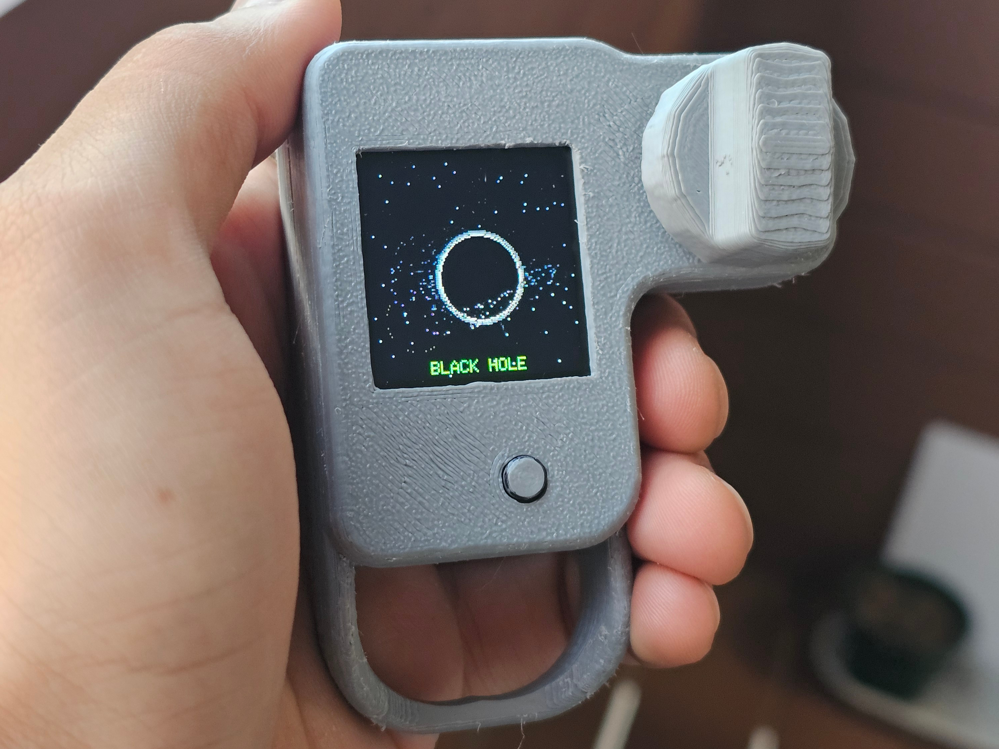

# Warp Drive Space Adventure Toy 🚀🪐

*An interactive, educational space travel experience for kids, built on ESP8266 and a colorful TFT display!*

---

## See It in Action!

<table>
  <tr>
    <td>
      
       🌟 The finished toy — ready for lift-off!
    </td>
    <td>
     
  🛠️ The sturdy, 3D-printed shell keeps everything kid-safe
    </td>
  </tr>
  <tr>
    <td>
      
 🔌 Simple wiring: ESP8266 + TFT + potentiometer knob
    </td>
    <td>
      <video width="420" height="320" controls style="border-radius:18px;object-fit:cover;">
  <source src="images/demo.mp4" type="video/mp4">
  Your browser does not support the video tag.
</video>

       🎬 Demo: Watch as we engage warp speed and discover a galaxy!
    </td>
  </tr>
</table>

---

## What is Warp Drive Space Adventure?

**Warp Drive Space Adventure** is a fun, hands-on gadget for curious kids who want to explore the wonders of space! Inspired by the excitement of Star Trek, this toy turns a tiny computer (the ESP8266) and a bright screen into your personal starship window. With just a twist of a knob, kids can travel at “warp speed,” discover amazing cosmic objects, and learn about real space science as playful animations bring the universe to life!

---

## Designed for Kids: Play, Imagine, and Learn!

- **Pure Wonder:** See twinkling stars, whizzing comets, spectacular planets, wild asteroid fields, and mind-bending black holes—all in brilliant color.
- **Intuitive Exploration:** Twist the big knob (a sturdy potentiometer!) to choose your speed. Go slow to drift among the stars, or push to max for a breathtaking warp jump!
- **Discovery Mode:** After each warp, a surprise cosmic object appears—planets, nebulae, spiral galaxies and more! No two adventures are the same.
- **Smooth Animations:** Clever programming means everything moves smoothly—no flicker or lag, just crisp cosmic action.
- **Optimized for Kids:** Display is bright, controls are simple, and all components are robust for little hands.

---

## Why This Toy Is Special (Educational & Fun!)

**Warp Drive Space Adventure** is more than a toy—it’s a playful introduction to physics, astronomy, and creativity:

- **STEAM Learning:** Kids see black holes, supernovae, and galaxies come alive, sparking curiosity about how space works.
- **Engaged Senses:** Colorful visuals and smooth motion encourage attention and imagination.
- **Cause & Effect:** The knob helps kids understand how changing speed affects what they see—a basic science concept!
- **No Screens Needed:** Unlike phone apps, this is a real, tangible toy kids can hold, tweak, and show friends.

---

## What’s Inside? (Tech for the Grown-Ups)

- **Hardware:**
  - ESP8266 microcontroller (NodeMCU, Wemos D1 Mini, etc.)
  - ST7735 color TFT screen (128x128 pixels)
  - Child-friendly potentiometer knob for speed control
  - All powered by USB or battery pack

- **Software:**
  - Three "states": *Normal* (starfield), *Warp* (zoom effect), *Discovery* (show random space wonders)
  - Dynamic drawing: Only updates changing parts for fast, flicker-free play
  - Custom visual effects: Particle systems, gravity, bright "blooms," and more
  - Sturdy, memory-safe code—no crashes or slowdowns

---

## How to Build One

1. **Collect Parts**
   - ESP8266 board
   - 128x128 TFT display (ST7735)
   - Potentiometer (big, easy to grip if possible)
   - Jumper wires and breadboard or pre-made kid-proof case

2. **Wire It Up** (Sample Default Wiring)

   | TFT Pin | ESP8266 Pin | Function        |
   |---------|-------------|-----------------|
   | CS      | D1 (GPIO5)  | Chip Select     |
   | RST     | D2 (GPIO4)  | Reset           |
   | DC      | D3 (GPIO0)  | Data/Command    |
   | MOSI    | D7 (GPIO13) | Data Out        |
   | SCK     | D5 (GPIO14) | Clock           |
   | GND/VCC | GND/3.3V    | Power           |
   | POT     | A0          | Speed Control   |

3. **Install Arduino (or PlatformIO), add ESP8266 & [TFT_eSPI](https://github.com/Bodmer/TFT_eSPI) library**
4. **Edit `User_Setup.h` in `TFT_eSPI` to match the above pins**
5. **Upload the code to your ESP8266**
6. **Turn it on and fly through the stars!**

---

## Features & Objects Kids Can Discover

- **Twinkling Starfields:** Always active, always magical
- **Planets:** Round, colorful worlds (some with rings or clouds)
- **Nebulae:** Wispy, glowing clouds of gas and dust (with floating particles)
- **Galaxies:** Spirals and star-swirls, sometimes spinning
- **Asteroids & Comets:** Rocks and icy visitors zoom by
- **Black Holes:** Gravity-bending holes with swirling light and zippy “falling stars”
- **Supernovae & Pulsars:** Flashy, spinning, or exploding stars

All objects use clever tricks so they look good even on a tiny, kid-safe screen.

---

## Future Ideas

*This project can grow along with your child’s curiosity!*
- Add sound effects or music
- Bigger displays for more details
- More controls (e.g., “scan” for facts about each discovery)
- Multi-player space races over Wi-Fi
- “Build your own planet” mode

---

## For Educators & Makers

Use this project to introduce microcontrollers, coding, and astronomy in a fun, engaging way. Great for STEM workshops or science fairs!

---

## License

MIT License — free for classrooms, makerspaces, and curious explorers everywhere.

---

## Credits & Thanks

Project inspired by classic science fiction, the open-source community, and every kid who’s ever looked up and wondered.

---

*Ready to explore the universe? Power up, twist the knob, and go where no toy has gone before!*

